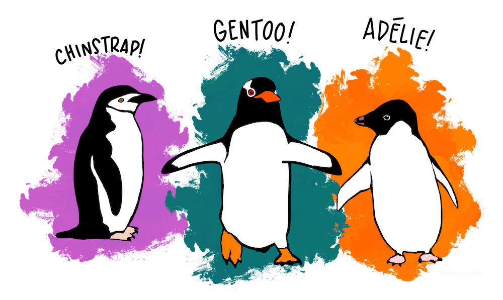

# CMM262: Statistics, Day 1 - Part 1 - Visualizing Data, Summary Statistics, and Distributions

**Credits**: Based on a prior notebook developed by former TAs Michelle Franc Ragsac (mragsac@eng.ucsd.edu) and Clarence Mah (ckmah@ucsd.edu) .




### Exercise 1 - Visualizing Data

> The Palmer Penguins dataset is based on data points collected and made available by [Dr. Kristen Gorman](https://www.uaf.edu/cfos/people/faculty/detail/kristen-gorman.php) and the [Palmer Station, Antarctica LTER](https://pal.lternet.edu/), a member of the [Long Term Ecological Research Network](https://lternet.edu/).
>
> Source: https://allisonhorst.github.io/palmerpenguins/


```{r}
# install the Palmer Penguins dataset
install.packages("palmerpenguins", repos="https://cloud.r-project.org")
install.packages("ggridges", repos="https://cloud.r-project.org")
```


Let's import the Palmer penguins library and load the penguins dataset
```{r}
library(palmerpenguins)
data(penguins, package='palmerpenguins')
```

The penguins dataset is in a [tibble](https://www.rstudio.com/blog/tibble-1-0-0/) which is a more user-friendly version of a data frame. We can view the data in the table:
```{r}
head(penguins, 20)
```


We can get a quick summary of the whole dataset using 'summary':

```{r}
summary(penguins)
```

When working with data, it is really important to visualize it. This provides you with a much better understanding of the data than simply computing a few statistics.

A histogram provides perhaps the simplest way to visualize data. Let's start by looking at bill length and bill depth. 
# TODO: add image showing bill length and bill depth?

The simplest way to make a histogram is with the hist function. 
```{r}
hist(penguins$bill_depth_mm)
```

We can use the breaks parameter to control the binning:
```{r}
hist(penguins$bill_length_mm, breaks=30)
```

[ggplot2](https://ggplot2.tidyverse.org/index.html) provides more powerful methods for plotting. ggplots syntax can take some getting used to. I recommend using a [ggplot2 cheatsheet](https://www.maths.usyd.edu.au/u/UG/SM/STAT3022/r/current/Misc/data-visualization-2.1.pdf) for reference.


```{r}
library(ggplot2)
ggplot(data=penguins, aes(bill_length_mm)) + geom_histogram()
```


Notice that the distribution looks bimodal. And remember we have 3 different species of penguin in our dataset. Let's see if the bill length differs by species. Let's make separate overlapping histograms in different colors for each species.

```{r}
ggplot(penguins, aes(x=bill_length_mm, fill=species)) + geom_histogram(position="identity", alpha=0.6, binwidth=2)
```

We can also visualize the distributions of the species as separate plots, using one of ggplot's faceting functions.

```{r}
ggplot(penguins, aes(x=bill_length_mm, fill=species)) + geom_histogram(binwidth=2) + facet_wrap(.~species)
```

If we want a more compact display, we can use boxplots or violin plots


```{r}
ggplot(penguins, aes(x=bill_length_mm, fill=species)) + geom_boxplot()
```


ggridges is a cool package that lets you plot overlapping density plots (smoothed histograms).

```{r}
library(ggridges)
ggplot(penguins, aes(x=bill_length_mm, y=species, fill=species)) + geom_density_ridges()
```


What if we want to view two variables at once for example, bill length and bill depth? We can use a scatter plot to view their joint distribution. We can use color and plotting shapes to indicate species and sex. 

```{r}
ggplot(penguins, aes(x=bill_length_mm, y=bill_depth_mm, color=species, shape=sex)) + geom_point()
```


### Exercise 2 - Summary Statistics

First, let's plot the distributions of bill lengths of male and female penguins separately for each species.

```{r}
ggplot(penguins, aes(x=bill_length_mm, fill=sex)) + geom_histogram(position="identity", alpha=0.6, binwidth=2) + facet_wrap(.~species)
```


```{r}
# first create vectors that can be used to pull out male or female chinstrap penguins
male.chinstraps = (penguins$species == "Chinstrap") & (penguins$sex == "male")
female.chinstraps = (penguins$species == "Chinstrap") & (penguins$sex == "female")
```

```{r}
n.male.chinstraps = sum(male.chinstraps)
cat("There are", n.male.chinstraps, "male chinstrap penguins\n")
```

```{r}
n.female.chinstraps = sum(female.chinstraps)
cat("There are", n.female.chinstraps, "female chinstrap penguins\n")
```

What are the sample mean bill lengths for the male and female chinstrap penguins?

Males: 
```{r}
# can compute manually
sum(penguins$bill_length_mm[male.chinstraps])/n.male.chinstraps

# or using the mean function
mean(penguins$bill_length_mm[male.chinstraps])
```

and Females:
```{r}
mean(penguins$bill_length_mm[female.chinstraps])
```

Now compute the sample standard deviation for male penguins:
```{r}
sample.var <- sum((penguins$bill_length_mm[female.chinstraps] -
                  mean(penguins$bill_length_mm[female.chinstraps]))**2)/(n.female.chinstraps-1)
sqrt(sample.var)
```

The n-1 in the denominator of the sample standard deviation is "Bessel's correction". It ensures that the sample standard deviation is an unbiased estimate of the population standard deviation.

We can also use the sd function to get the same result:
```{r}
sd(penguins$bill_length_mm[female.chinstraps])
```

Now compute sample standard deviation for male chinstraps:
```{r}
sd(penguins$bill_length_mm[male.chinstraps])
```

Another common summary statistic is the median, which is the middle value of a sample.
```{r}
median(penguins$bill_length_mm[male.chinstraps])
```

```{r}
median(penguins$bill_length_mm[female.chinstraps])
```

Summary statistics are really useful, but they often obscure different characteristics of the data, such as the shape of the distribution or the presence of outliers. For example, if we just computed summary statistics on all penguins, we might not have realized that there were two modes or that different species of penguins had different distributions. In summary, compute summary statistics, but also visualize your data! 

### Exercise 3 - The binomial distribution


